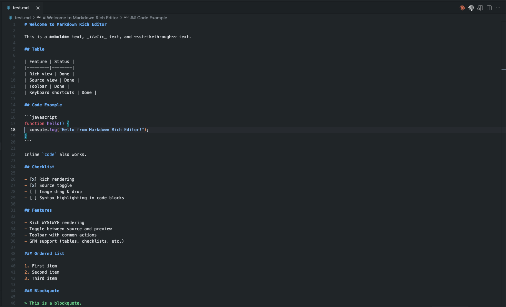
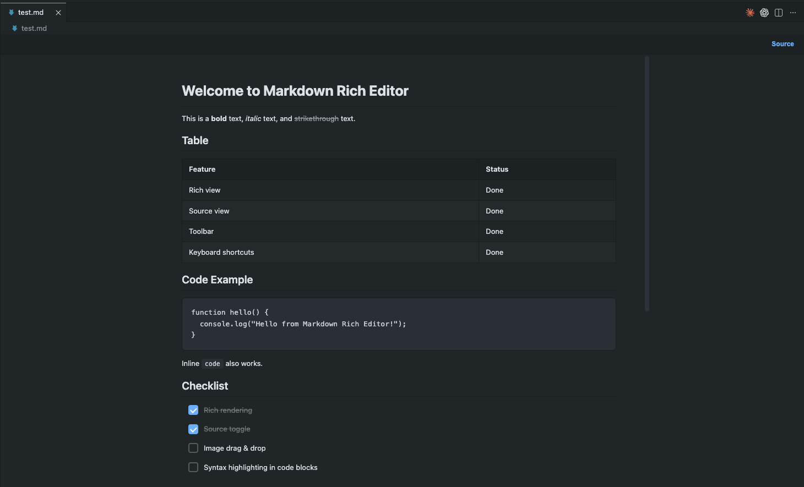
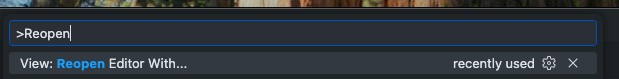
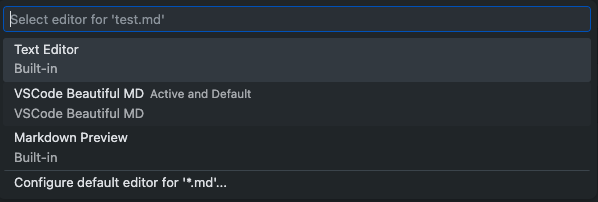

<p align="center">
  
</p>

<h1 align="center">VSCode Beautiful MD</h1>

<p align="center">
  <strong>Stop reading raw markdown. Start reading beautiful documents.</strong>
</p>

<p align="center">
  A WYSIWYG markdown editor that renders your <code>.md</code> files as clean, rich documents — directly inside VSCode. No preview pane. No split view. Just open a file and see it beautifully rendered.
</p>

---

## Before & After

**Without Beautiful MD** — raw syntax, hard to scan:



**With Beautiful MD** — clean, readable, interactive:



---

## Why Beautiful MD?

Most markdown extensions give you a **side-by-side preview**. You still stare at raw syntax half the time.

Beautiful MD **replaces** the editor. When you open a `.md` file, you see the final result immediately — styled headings, rendered tables, interactive checklists, formatted code blocks. No commands to run, no panels to open.

Need to edit? Hit **Source** and you're back to raw markdown. Hit **Preview** and you're back to the beautiful view. That's it.

## Features

- **Instant rich rendering** — `.md` files open as formatted documents by default
- **Interactive checklists** — click to check/uncheck directly in preview, the source file updates automatically
- **Source/Preview toggle** — switch between raw markdown and rich view with one click
- **Formatting toolbar** — bold, italic, headings, lists, code blocks, links, and more
- **Keyboard shortcuts** — `Cmd+B` for bold, `Cmd+I` for italic, `Tab` for indent
- **GFM support** — tables, strikethrough, task lists, fenced code blocks
- **Adapts to your theme** — respects your VSCode dark/light theme colors
- **Empty file detection** — new `.md` files open directly in source mode, ready to write
- **Secure** — HTML sanitized with DOMPurify, strict Content Security Policy, no `unsafe-inline`

## Getting Started

### 1. Install the extension

Search for **"VSCode Beautiful MD"** in the Extensions panel, or install from a `.vsix` file:

```
code --install-extension vscode-beautiful-md-0.1.0.vsix
```

### 2. Open any `.md` file

It renders automatically. No command needed.

### 3. Switch editor (optional)

If you want to switch between Beautiful MD and the classic text editor:

1. Press `Cmd+Shift+P` (or `Ctrl+Shift+P`)
2. Type **"Reopen"**



3. Select **"VSCode Beautiful MD"** to use the rich view, or **"Text Editor"** for classic mode



## Toolbar Actions

Available in **Source mode**:

| Action | Button | Shortcut |
|--------|--------|----------|
| Bold | **B** | `Cmd+B` |
| Italic | *I* | `Cmd+I` |
| Strikethrough | ~~S~~ | — |
| Heading 1/2/3 | H1 H2 H3 | — |
| Unordered list | - List | — |
| Ordered list | 1. List | — |
| Checklist | Check | — |
| Inline code | `</>` | — |
| Code block | `{ }` | — |
| Blockquote | " | — |
| Link | Link | — |
| Horizontal rule | Line | — |
| Indent | — | `Tab` |

## Contributing

Found a bug? Have a feature idea? [Open an issue](https://github.com/lockey33/VSCODE-BEAUTIFUL-MD/issues) on GitHub.

## License

MIT
